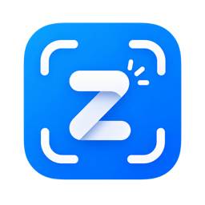

<p align="center">
  
</p>

<h1 align="center">Znap</h1>

<p align="center">
  A lightweight macOS menu bar app for screenshots and screen recording.<br>
  Snap an area, a window, or the full display — or record video of any region — straight from the menu bar.
</p>

<p align="center">
  
  
  
</p>

## Features

- **Screenshots** — capture a selected area, a specific window, or the full screen.
- **Screen recording** — record a selected area or a window to video.
- **Menu bar native** — lives in the menu bar, no Dock icon, no clutter.
- **Instant preview** — see what you just captured in a floating preview panel.
- **Saves to Desktop** — captures land on your Desktop with timestamped filenames.
- **Recording indicator** — the menu bar icon turns into a red dot while recording.
- **Built with ScreenCaptureKit** — Apple's modern, efficient capture framework.
- **Universal binary** — runs natively on both Apple Silicon and Intel Macs.

## Requirements

- macOS 14 (Sonoma) or later
- Xcode command-line tools (`xcode-select --install`)
- Swift 5.9+

## Install

Clone the repo and run the build script:

```bash
git clone https://github.com/<your-username>/znap.git
cd znap
./build.sh
```

The script will:

1. Build a release universal binary via Swift Package Manager.
2. Assemble a `Znap.app` bundle with the right `Info.plist` and icons.
3. Ad-hoc sign it.
4. Install it to `~/Applications/Znap.app` (searchable in Spotlight).

Launch it with:

```bash
open ~/Applications/Znap.app
```

On first launch, macOS will prompt for **Screen Recording** permission. Grant it in **System Settings → Privacy & Security → Screen Recording**, then relaunch the app.

## Usage

Click the Znap icon in the menu bar to open the menu:

| Action               | Shortcut |
| -------------------- | -------- |
| Capture Area         | ⌘1       |
| Capture Full Screen  | ⌘3       |
| Capture Window       | ⌘4       |
| Record Area          | ⌘5       |
| Record Window        | ⌘6       |
| Stop Recording       | ⌘S       |
| Quit Znap            | ⌘Q       |

> Shortcuts trigger from within the open menu. While recording, the menu bar icon turns into a red dot — click it and choose **Stop Recording** to finish.

All captures are saved to your **Desktop**. Use **Open Save Folder** from the menu to reveal them in Finder.

## Project Structure

```
znap/
├── App/
│   ├── Info.plist          # bundle metadata (LSUIElement, permissions)
│   └── Resources/          # icons (app + menu bar)
├── Assets/                 # source artwork
├── Sources/Znap/           # Swift source
│   ├── main.swift          # AppDelegate + status item menu
│   ├── Capture.swift       # screenshot pipeline
│   ├── Recording.swift     # video recording pipeline
│   ├── AreaSelection.swift # drag-to-select overlay
│   ├── WindowPicker.swift  # window picker UI
│   ├── PreviewPanel.swift  # post-capture preview
│   ├── WelcomeWindow.swift # first-launch welcome window
│   └── Util.swift          # shared helpers (SaveLocation, etc.)
├── scripts/
│   └── generate-icons.sh   # regenerate .icns from Assets/
├── Package.swift
└── build.sh                # build → bundle → sign → install
```

## Development

Build without bundling (for iterating in the terminal):

```bash
swift build
swift run Znap
```

Build a release universal binary:

```bash
swift build -c release --arch arm64 --arch x86_64
```

Regenerate app icons from `Assets/Znap.iconset`:

```bash
./scripts/generate-icons.sh
```

## Permissions

Znap declares `NSScreenCaptureUsageDescription` and uses Apple's **ScreenCaptureKit** for both screenshots and recording. No other permissions are requested.

## License

MIT — see [LICENSE](LICENSE).
